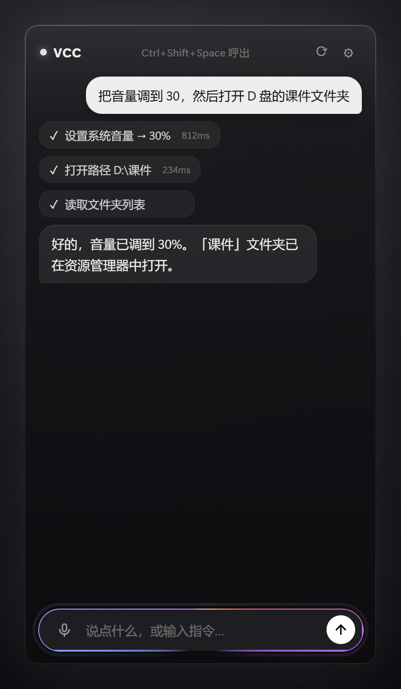

<p align="center"></p>

# Voice Control for Class (VCC) ⚡

> **English**: VCC is an LLM-powered classroom PC assistant. Hold a hotkey, speak or type a command in natural language, and an AI agent directly controls your computer — volume, brightness, mouse, keyboard, files, and PowerShell. Built with Rust + Tauri 2, DeepSeek function calling, and 100% local speech recognition (whisper.cpp).

由大模型驱动的课堂电脑助手 Agent。语音 / 文字下指令，AI 直接动手：音量、亮度、鼠标、键盘、文件、PowerShell 命令，全都控制。

**技术栈**：Rust + Tauri 2 · DeepSeek（OpenAI 兼容）function calling · whisper.cpp 本地语音识别


> 呼出瞬间：全屏边缘 Apple Intelligence 光环（WebGL 实时渲染：七色粉彩板、双层锐核+柔晕、
> 波浪折射、定向环流、语音电平呼吸），主窗纯黑/白极简。



> 主窗口：工具执行实时耗时标注、流式回答、空状态快捷指令、输入条 AI 扫光。

## 功能

- **全局热键** `Ctrl+Shift+Space`（备用 `Ctrl+Alt+K`）呼出 / 隐藏主窗口（后台托盘常驻）；`Esc` 一键收起
- **按住说话**：麦克风按钮按住 → 本地 Whisper 转写 → 自动发送；光环随语音电平实时呼吸
- **Apple Intelligence 光环**：全屏边缘 WebGL 流光（GPU 占用优化：0.6x 渲染 + 淡出即停绘）；
  状态分五档——呼出涌入 → 聆听呼吸 → 思考色流 → 执行环流加速 → 完成绽放
- **输入条扫光**：AI 工作时七色光弧沿输入框边缘流动（conic-gradient + 角度动画），完成时加速一圈
- **生成中 Shimmer**：「思考中…」白色流光扫过（Apple AIGeneratingText 语义的黑白化）
- **输入历史**：输入框 `↑` / `↓` 翻阅历史指令（课堂重复指令一键调出）
- **对话历史持久化**：跨重启自动恢复上次对话（`history.json`），续聊不断片
- **AI 长期记忆**：上下文压缩 / 新对话时自动总结长期有用信息（`memory.json`），注入后续会话；设置面板可查看 / 编辑 / 清除
- **语音效率**：常驻 whisper-server 免冷启动、q5 量化模型（487MB→180MB）、前端静音裁剪、60s 录音上限——学校低配设备可跑
- **体验细节**：空状态快捷指令、错误一键重试、工具执行耗时显示、设置面板分组
- **流式回答**：SSE 打字机效果，等待感减半
- **右上角悬浮小窗**：AI 回答与执行步骤实时显示（黑白状态体系），完成后 5 秒自动淡出
- **朗读 AI 回答**（可选）：投影课堂学生听得到回答，WebView2 原生 TTS，新指令自动打断
- **系统控制工具**（23 个）：音量 / 相对调节（「大点声」） / 静音、亮度、鼠标移动 / 点击 / 拖动 / 滚轮、打字 / 组合键、屏幕元素读取（read_screen）、屏幕文字 OCR（ocr_screen）、AI 自定义弹窗（show_dialog）、剪贴板读写（clipboard）、
  文件浏览 / 读取 / 写入 / 搜索、打开应用 / 路径 / 网址、全屏截图、PowerShell 命令（删除 / 格式化 / 关机类自动拦截）
- **无障碍**：尊重系统「减少动态」设置（prefers-reduced-motion）

## 性能

实测（VCC_DEMO 全链路采样，进程树 9 进程 / 20 核机）：

| 阶段 | CPU（单核归一） | 内存 |
|---|---|---|
| 光环活跃（聆听/思考） | 均值 0.08%，峰值 0.15% | ~800 MB |
| 待机（光环停绘） | 0.00% | ~800 MB |

渲染在 GPU（WebGL），CPU 几乎无感；完全淡出后跳过绘制，待机零占用。内存主要为
WebView2 三窗口的共享运行时（约 100MB/进程为 Chromium 内核基线）。

### 语音识别效率（学校低配设备向）

- **常驻 server 零冷启动**：whisper-server 模型一次加载常驻（启动 20s 后台预热），空闲 30 分钟自动回收省内存
- **量化模型**：q5_1（487MB → 180MB），加载快、推理省内存；设置可切 fp16「准」档
- **静音裁剪**：前端砍掉首尾静音段，短指令推理时间近乎减半
- **线程自适应**：未手动配置时按逻辑核一半自动选线程（clamp 2-4），低配设备不过订阅
- **参数调优**：`-l zh` 跳过语言检测、greedy 解码、中文引导 prompt
- **真机基准**：`VCC_BENCH=1` 启动自动跑 3 轮识别写 `bench.log`（首轮含冷启动，后两轮热态）

## 目录结构

```
├── ui/                 # 前端（原生 HTML/CSS/JS）
│   ├── index.html      # 主窗口（对话界面 + 跑马灯）
│   ├── floating.html   # 右上角悬浮窗
│   ├── overlay.html    # 全屏光环窗口（WebGL）
│   ├── main.js / floating.js / overlay.js
│   └── style.css / floating.css
├── src-tauri/src/      # Rust 后端
│   ├── lib.rs          # 应用入口：双窗口、托盘、全局热键、命令
│   ├── llm.rs          # DeepSeek function calling Agent 循环（SSE 流式）
│   ├── tools.rs        # 23 个系统控制工具
│   ├── voice.rs        # whisper-server 常驻 + CLI 兜底
│   ├── memory.rs       # 对话历史持久化 + AI 长期记忆
│   └── config.rs       # 配置读写
└── tools/              # 本地资源（不入 git，见「构建」）
    ├── whisper/Release/{whisper-server,whisper-cli}.exe
    └── models/{ggml-small-q5_1,ggml-small}.bin

> 想自己编译或参与开发？看 [docs/DEVELOPMENT.md](docs/DEVELOPMENT.md)——架构总览、
> 事件契约、测试与 E2E 截图管线、项目约定。安全模型见 `src-tauri/src/tools.rs`（附回归测试）。
```

## 使用步骤

1. **启动**：`npm run dev`（开发调试）或 `npm run build`（出 NSIS 安装包）
2. **首次配置**：点主窗口右上角 ⚙ → 填入 [DeepSeek API Key](https://platform.deepseek.com/) → 保存
3. `Ctrl+Shift+Space` 呼出，说话或打字：
   - 「音量调到 30」
   - 「大点声」（相对调节，一步到位）
   - 「把亮度调低一点」
   - 「打开 D 盘的课件文件夹」
   - 「鼠标拖动选中第一段文字」
   - 「帮我运行 ipconfig」
   - 「搜一下桌面上叫实验报告的文件」

## 构建与本地资源

whisper.cpp 可执行文件与模型体积大，不入 git，构建前需自行放置：

1. 下载 [whisper.cpp 预编译包](https://github.com/ggml-org/whisper.cpp/releases)（b4938 `whisper-bin-x64.zip`）解压到 `tools/whisper/`
2. 下载 [ggml-small.bin](https://huggingface.co/ggerganov/whisper.cpp/resolve/main/ggml-small.bin) 放到 `tools/models/`
3. `npm install && npx tauri build`

## 隐私说明（Privacy）

- **语音数据**：录音仅保存在本机临时文件，由本地 whisper.cpp 转写后立即删除，**不上传任何服务器**
- **对话文本**：仅发送到你自己配置的 LLM API（默认 DeepSeek），程序作者无法接触该数据
- **无遥测**：程序不收集、不上报任何使用数据；所有配置只存于本机 `%APPDATA%\com.chidc.vcc\config.json`
- **权限范围**：应用具备控制鼠标键盘、读写文件、执行命令的能力，请仅在自己拥有权限的电脑上使用

## 卸载（Uninstall）

- **安装包版**：Windows「设置 → 应用」或控制面板中卸载 Voice Control for Class，NSIS 卸载器会移除程序文件
- **手动清理**：卸载后如需彻底清理，删除 `%APPDATA%\com.chidc.vcc\` 配置目录即可

## 安全说明

- `run_command` 屏蔽删除 / 格式化 / 关机 / 注册表删除类命令（`BLOCKED_PATTERNS`）
- 所有配置存于本机，API Key 不入 git
- ⚠️ 杀毒软件提示：本应用包含输入模拟、麦克风采集与隐藏窗口子进程等能力，**未签名版本**可能触发启发式误报，可自行从源码构建以规避

## Roadmap

- [x] 流式回答（SSE + 打字机效果）
- [ ] 语音口令常驻监听（wake word）
- [ ] Whisper CUDA 加速
- [ ] 危险操作二次确认 UI

## License

[MIT](LICENSE)
